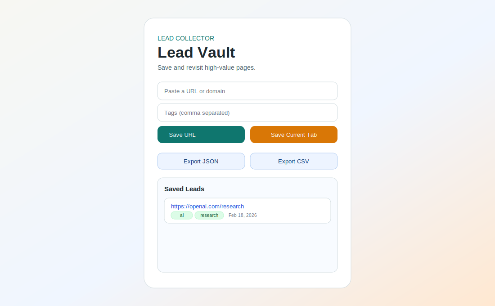
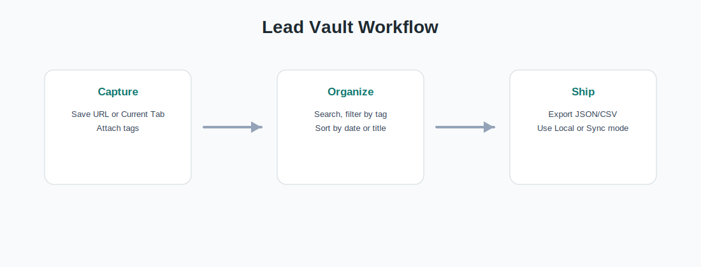

# Lead Vault Chrome Extension

Lead Vault is a modern Chrome extension popup that helps you capture, store, and manage useful URLs while browsing.

## Demo

For a short GIF recording of the real extension popup, add `assets/lead-vault-demo.gif` and embed it in this section.

## Why This Project Stands Out

- Clean, intentional UI for a polished first impression
- Fast one-click capture of the current tab
- URL validation and automatic normalization (`https://` handling)
- Duplicate prevention to keep data clean
- Tag-based organization and filtering
- Search and sort controls for fast retrieval
- One-click JSON and CSV exports
- Optional Chrome Sync mode (`chrome.storage.sync`)
- Persistent storage with extension APIs
- Per-item remove plus quick full reset controls
- Accessible live status messages and keyboard support

## Tech Stack

- HTML5
- CSS3
- Vanilla JavaScript (ES6+)
- Chrome Extensions Manifest V3 APIs

## Project Structure

- `manifest.json`: Chrome extension config and permissions
- `index.html`: Popup layout and semantic structure
- `index.css`: Visual design and responsive popup styling
- `index.js`: Main app orchestration and event flow
- `js/config.js`: Shared constants
- `js/storage.js`: Chrome storage and legacy migration
- `js/utils.js`: URL normalization and safe formatting helpers
- `js/ui.js`: DOM references, rendering, and status updates

## How to Run Locally

1. Open `chrome://extensions/` in Chrome.
2. Enable **Developer mode** (top-right).
3. Click **Load unpacked**.
4. Select this project folder.
5. Pin and open the extension from the toolbar.

## Testing

1. Run `npm test` for automated tests.
2. Run `npm run check` for syntax checks.

## Packaging

1. Run `npm run package` to generate `dist/lead-vault-extension.zip`.
2. Upload that zip to Chrome Web Store developer dashboard.
3. Follow the release checklist in `docs/chrome-web-store-release.md`.

## Chrome Web Store

- Release checklist: `docs/chrome-web-store-release.md`
- After publishing, add your public listing URL here.

## Key Product Decisions

- Built a storage layer that supports both `chrome.storage.local` and optional `chrome.storage.sync`.
- Migrated old lead formats to a consistent object model.
- Added safer rendering and URL checks to reduce malformed input, merge duplicate tags, and keep data clean.
- Built a branded popup layout designed to feel portfolio-grade rather than scaffold-level.
